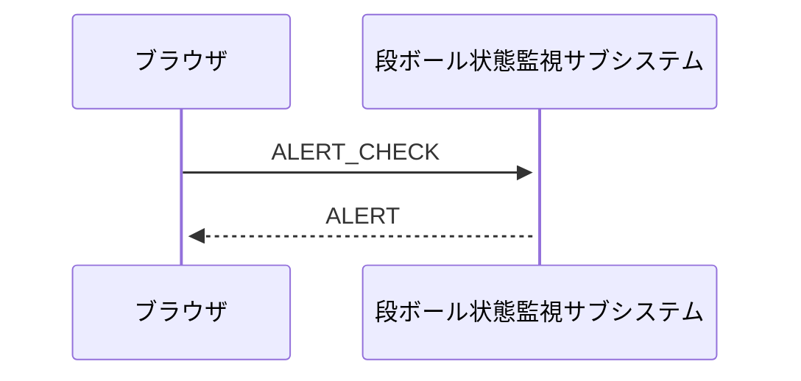
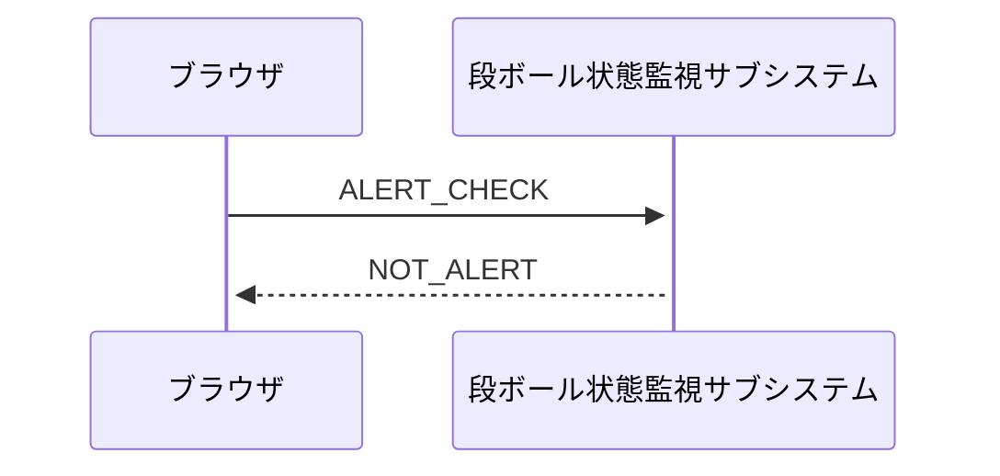
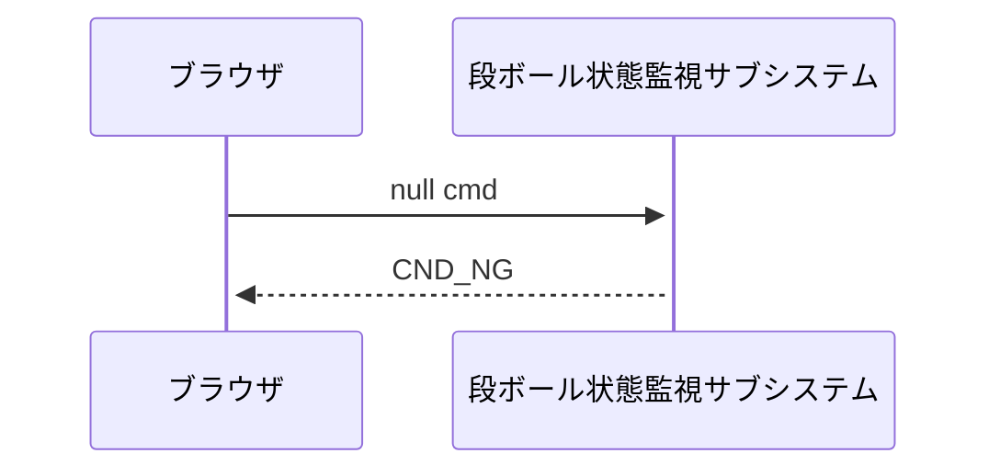

8-1: アラートの監視(アラート発生時)
-

```mermaid
    sequenceDiagram;
        participant d_sub as ブラウザ;
        participant s_sub as 段ボール状態監視サブシステム;
        d_sub->>+s_sub: ALERT_CHECK;
        s_sub-->>+d_sub: ALERT;
```

8-2: アラートの監視(アラート未発生時)
-

```mermaid
    sequenceDiagram;
        participant d_sub as ブラウザ;
        participant s_sub as 段ボール状態監視サブシステム;
        d_sub->>+s_sub: ALERT_CHECK;
        s_sub-->>+d_sub: NOT_ALERT;
```

8-3: コマンドが間違っている、または存在していない
-

```mermaid
    sequenceDiagram;
        participant d_sub as ブラウザ;
        participant s_sub as 段ボール状態監視サブシステム;
        d_sub->>+s_sub: null cmd;
        s_sub-->>+d_sub: CND_NG;
```
