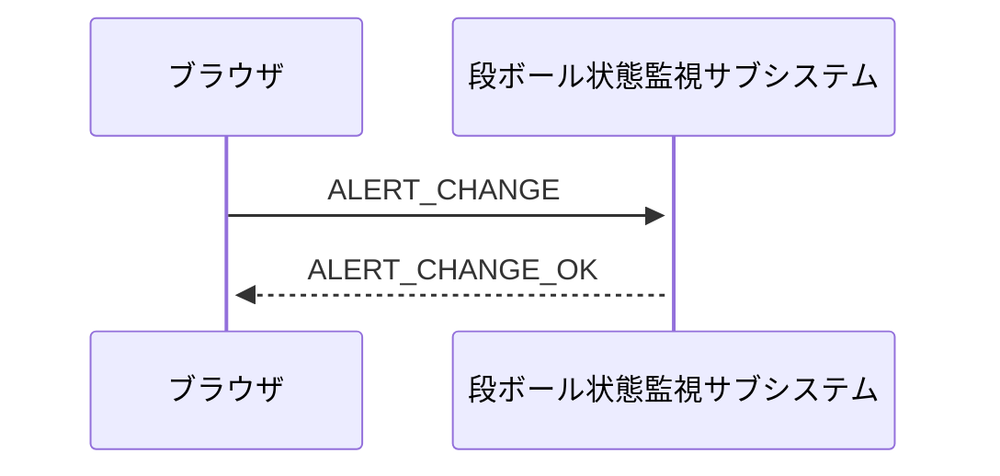
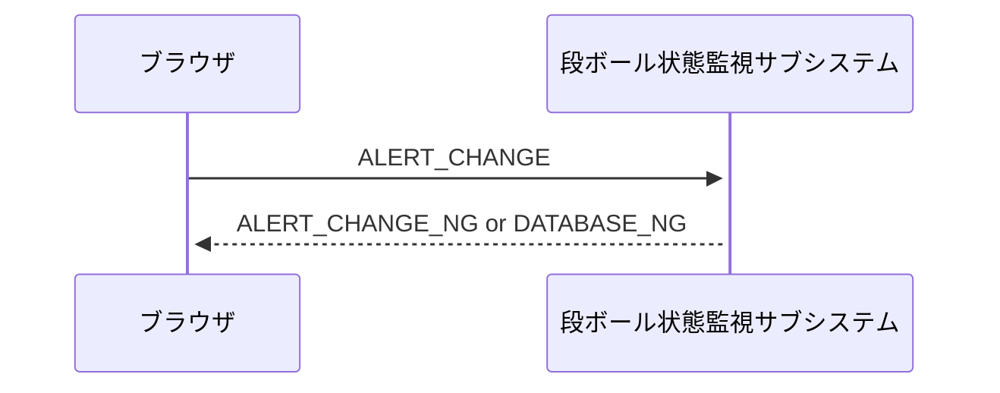
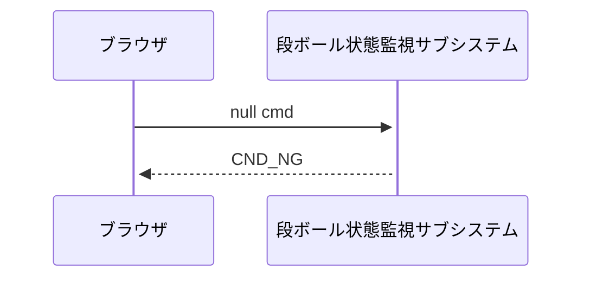

10-1: アラート解除成功
-

```mermaid
    sequenceDiagram;
        participant d_sub as ブラウザ;
        participant s_sub as 段ボール状態監視サブシステム;
         d_sub->>+s_sub: ALERT_CHANGE;
        s_sub-->>+d_sub: ALERT_CHANGE_OK;
```

10-2: アラート解除失敗
-

```mermaid
    sequenceDiagram;
        participant d_sub as ブラウザ;
        participant s_sub as 段ボール状態監視サブシステム;
         d_sub->>+s_sub: ALERT_CHANGE;
        s_sub-->>+d_sub: ALERT_CHANGE_NG or DATABASE_NG;
```

10-3: コマンドが間違っている、または存在していない
-

```mermaid
    sequenceDiagram;
        participant d_sub as ブラウザ;
        participant s_sub as 段ボール状態監視サブシステム;
        d_sub->>+s_sub: null cmd;
        s_sub-->>+d_sub: CND_NG;
```
