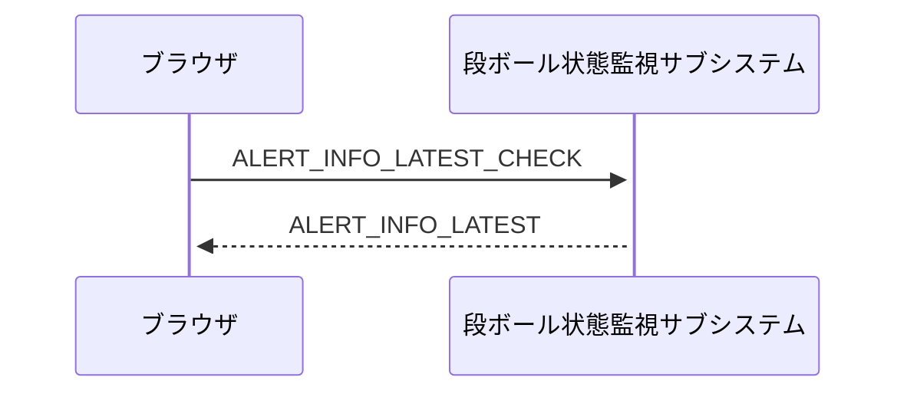
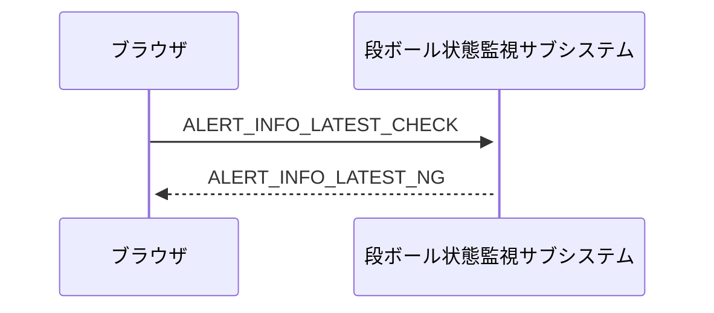
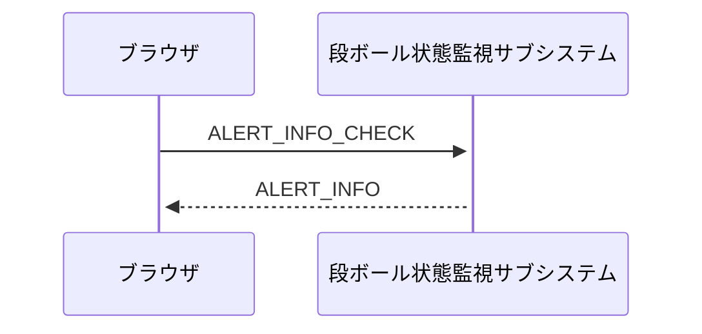
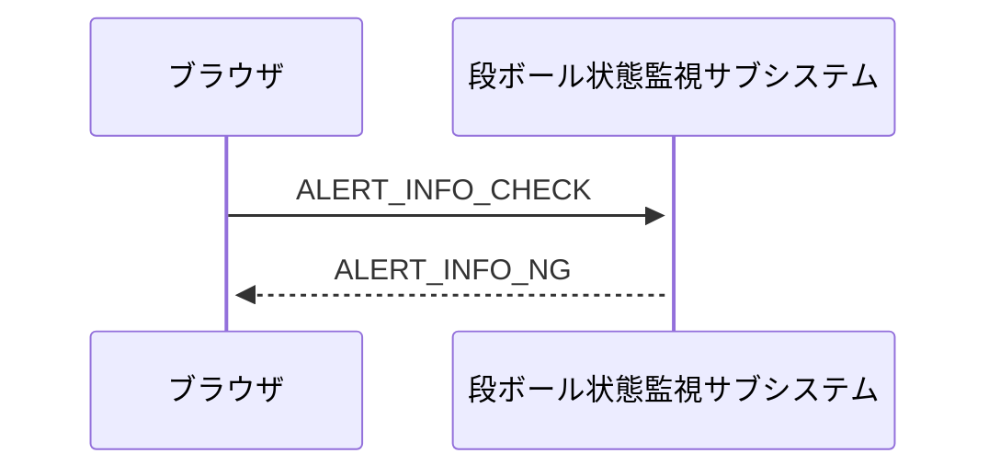
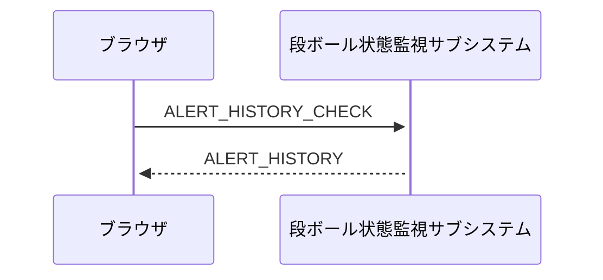
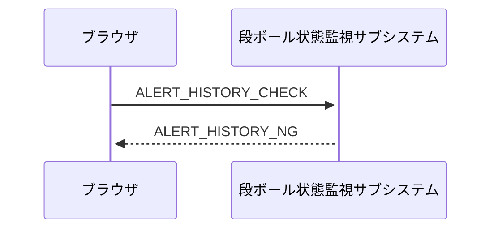
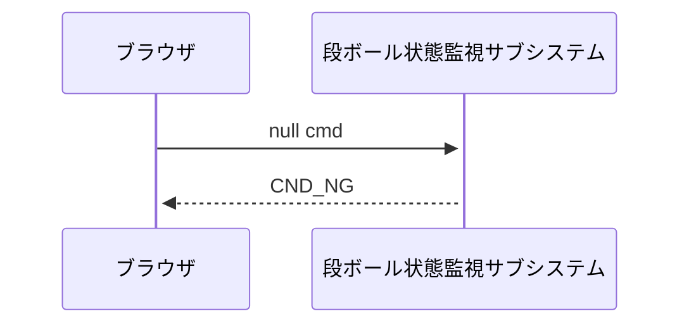

9-1: 最新のアラート情報を取得する（成功）
-

9-2: 最新のアラート情報を取得する（失敗）
-

9-3: 発生しているアラートをすべて取得する（成功）
-

9-4: 発生しているアラートをすべて取得する（失敗）
-

9-5: アラートの情報をすべて取得する（成功）
-

9-6: アラートの情報をすべて取得する（失敗）
-

9-7: コマンドが間違っている、または存在していない
-

