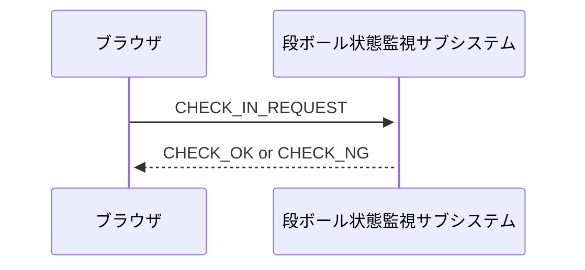
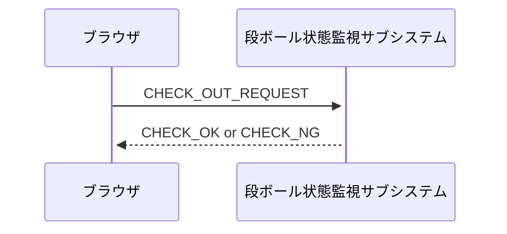

7-1: 出勤処理
-

```mermaid
    sequenceDiagram;
        participant d_sub as ブラウザ;
        participant s_sub as 段ボール状態監視サブシステム;
        d_sub->>+s_sub: CHECK_IN_REQUEST;
        s_sub-->>+d_sub: CHECK_OK or CHECK_NG;
```

7-2: 退勤処理
-

```mermaid
    sequenceDiagram;
        participant d_sub as ブラウザ;
        participant s_sub as 段ボール状態監視サブシステム;
        d_sub->>+s_sub: CHECK_OUT_REQUEST;
        s_sub-->>+d_sub: CHECK_OK or CHECK_NG;
```
