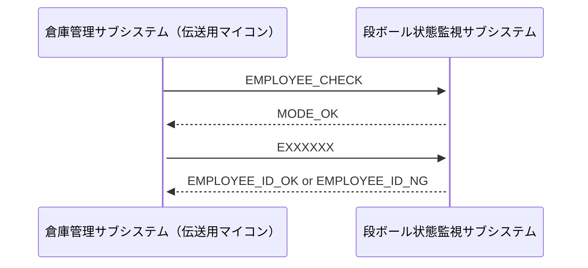
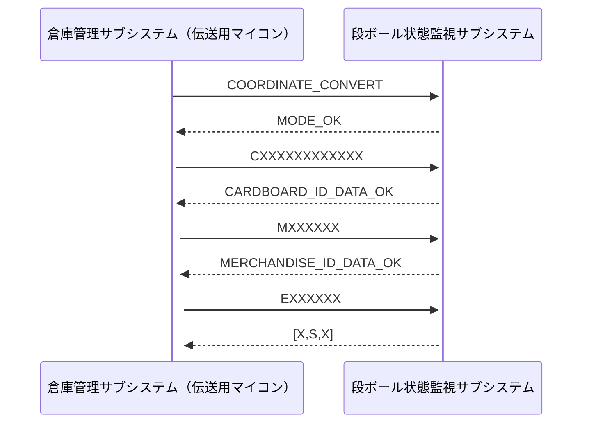
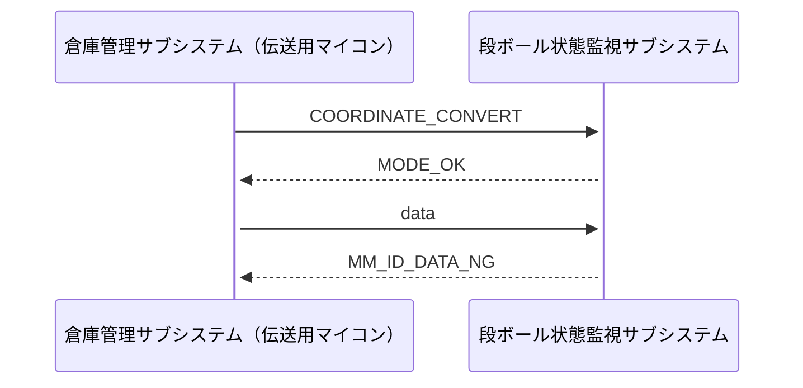
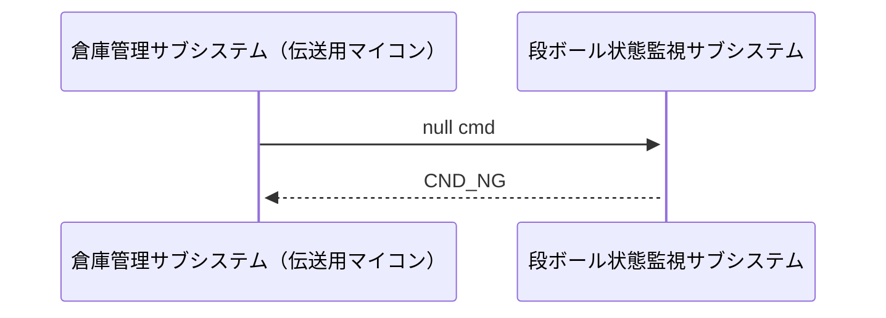

4-1: 社員チェック
-

```mermaid
    sequenceDiagram;
        participant d_sub as 倉庫管理サブシステム（伝送用マイコン）;
        participant s_sub as 段ボール状態監視サブシステム;
        d_sub->>+s_sub: EMPLOYEE_CHECK;
        s_sub-->>+d_sub: MODE_OK;
        d_sub->>s_sub: EXXXXXX;
        s_sub-->>+d_sub: EMPLOYEE_ID_OK or EMPLOYEE_ID_NG;
```

4-2: 搬入処理（成功）
-

```mermaid
    sequenceDiagram;
        participant d_sub as 倉庫管理サブシステム（伝送用マイコン）;
        participant s_sub as 段ボール状態監視サブシステム;
        d_sub->>+s_sub: COORDINATE_CONVERT;
        s_sub-->>+d_sub: MODE_OK;
        d_sub->>s_sub: CXXXXXXXXXXXX;
        s_sub-->>+d_sub: CARDBOARD_ID_DATA_OK;
        d_sub->>s_sub: MXXXXXX;
        s_sub-->>+d_sub: MERCHANDISE_ID_DATA_OK;
        d_sub->>s_sub: EXXXXXX;
        s_sub-->>+d_sub: [X,S,X];
```

4-3: 搬入処理（データ受信失敗）
-

```mermaid
    sequenceDiagram;
        participant d_sub as 倉庫管理サブシステム（伝送用マイコン）;
        participant s_sub as 段ボール状態監視サブシステム;
        d_sub->>+s_sub: COORDINATE_CONVERT;
        s_sub-->>+d_sub: MODE_OK;
        d_sub->>s_sub: data;
        s_sub-->>+d_sub: MM_ID_DATA_NG;
```

4-4: コマンドが間違っている、または存在していない
-

```mermaid
    sequenceDiagram;
        participant d_sub as 倉庫管理サブシステム（伝送用マイコン）;
        participant s_sub as 段ボール状態監視サブシステム;
        d_sub->>+s_sub: null cmd;
        s_sub-->>+d_sub: CND_NG;
```
