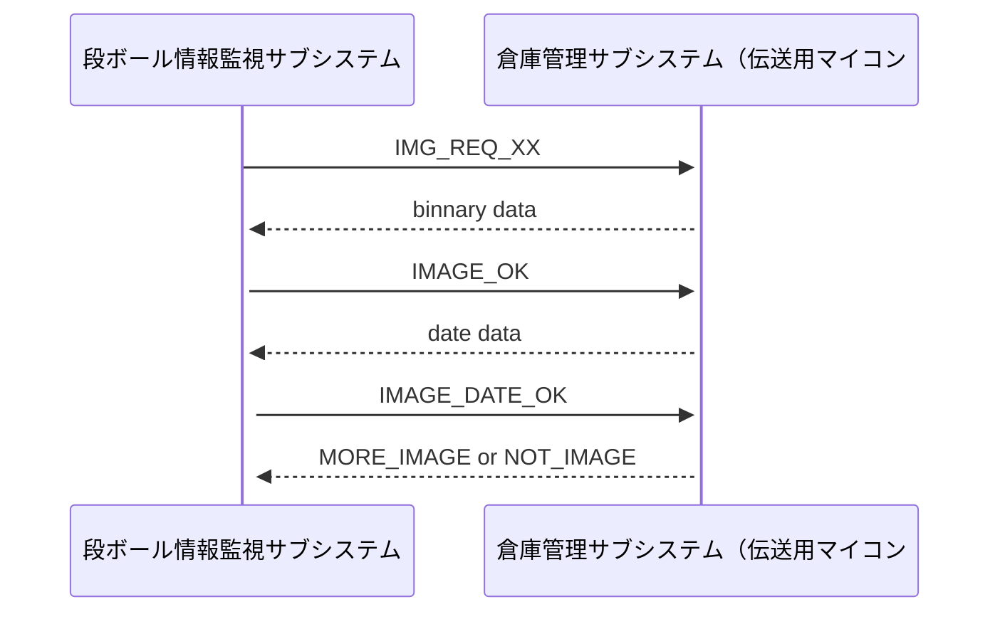
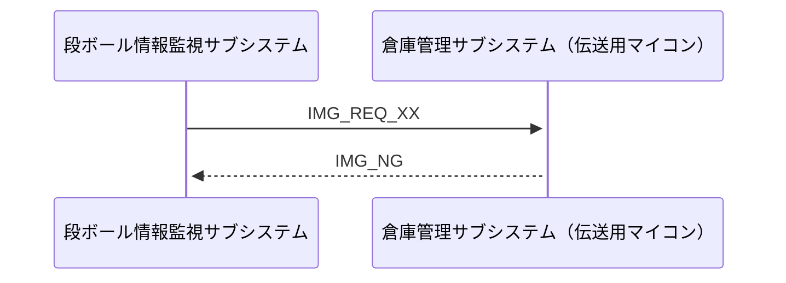
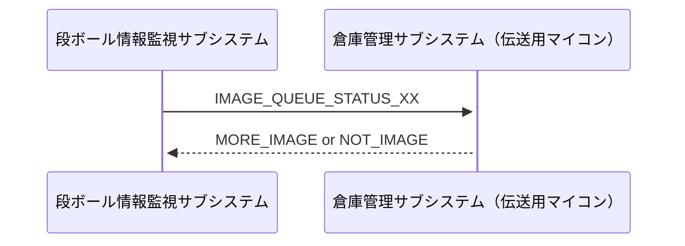
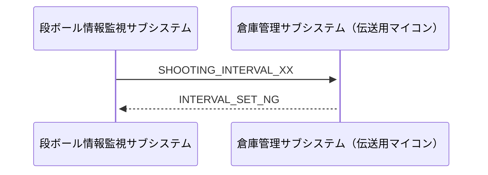
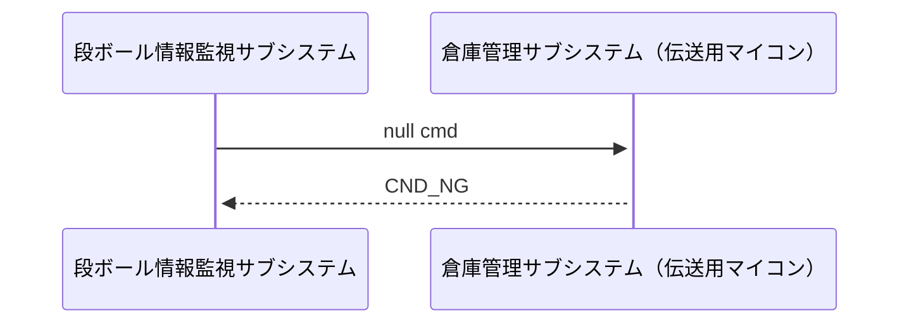

1-1: 画像取得成功
-

```mermaid
    sequenceDiagram;
        participant d_sub as 段ボール情報監視サブシステム;
        participant s_sub as 倉庫管理サブシステム（伝送用マイコン;
        d_sub->>+s_sub: IMG_REQ_XX;
        s_sub-->>+d_sub: binnary data;
        d_sub->>s_sub: IMAGE_OK;
        s_sub-->>+d_sub: date data;
        d_sub->>s_sub: IMAGE_DATE_OK;
        s_sub-->>+d_sub: MORE_IMAGE or NOT_IMAGE;
```

1-2: 画像取得失敗
-

```mermaid
    sequenceDiagram;
        participant d_sub as 段ボール情報監視サブシステム;
        participant s_sub as 倉庫管理サブシステム（伝送用マイコン）;
        d_sub->>+s_sub: IMG_REQ_XX;
        s_sub-->>+d_sub: IMG_NG;
```

1-3: 画像が存在しているか確認
-

```mermaid
    sequenceDiagram;
        participant d_sub as 段ボール情報監視サブシステム;
        participant s_sub as 倉庫管理サブシステム（伝送用マイコン）;
        d_sub->>+s_sub: IMAGE_QUEUE_STATUS_XX;
        s_sub-->>+d_sub: MORE_IMAGE or NOT_IMAGE;
```

1-4: 画像を撮影する間隔の変更（成功）
-

```mermaid
    sequenceDiagram;
        participant d_sub as 段ボール情報監視サブシステム;
        participant s_sub as 倉庫管理サブシステム（伝送用マイコン）;
        d_sub->>+s_sub: SHOOTING_INTERVAL_XX;
        s_sub-->>+d_sub: INTERVAL_SET_OK;
```

1-5: 画像を撮影する間隔の変更（失敗）
-

```mermaid
    sequenceDiagram;
        participant d_sub as 段ボール情報監視サブシステム;
        participant s_sub as 倉庫管理サブシステム（伝送用マイコン）;
        d_sub->>+s_sub: SHOOTING_INTERVAL_XX;
        s_sub-->>+d_sub: INTERVAL_SET_NG;
```

1-6: コマンドが間違っている、または存在していない
-

```mermaid
    sequenceDiagram;
        participant d_sub as 段ボール情報監視サブシステム;
        participant s_sub as 倉庫管理サブシステム（伝送用マイコン）;
        d_sub->>+s_sub: null cmd;
        s_sub-->>+d_sub: CND_NG;
```
