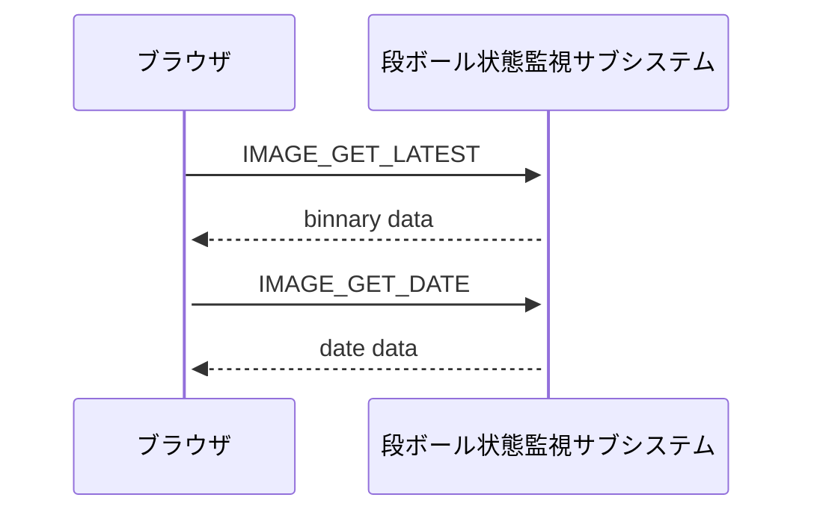
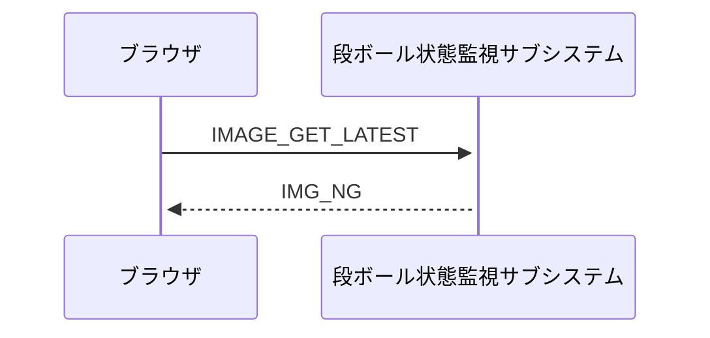
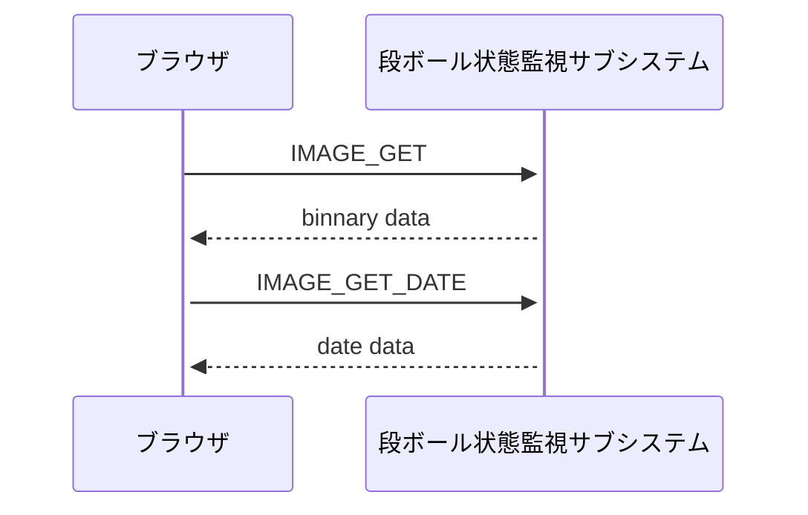
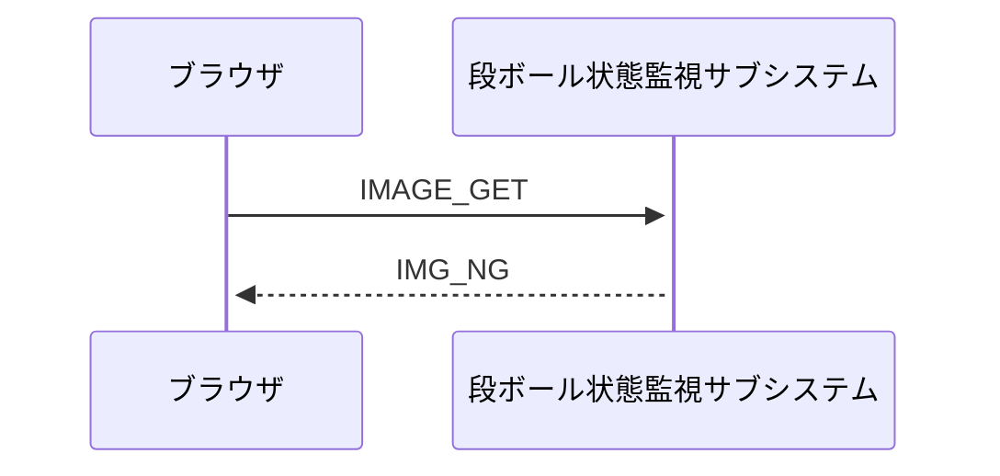
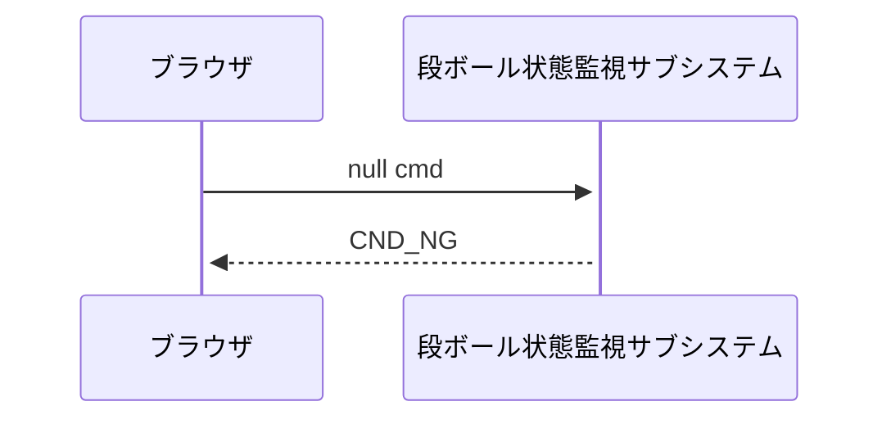

3-1: 最新画像取得（成功）
-

```mermaid
    sequenceDiagram;
        participant d_sub as ブラウザ;
        participant s_sub as 段ボール状態監視サブシステム;
        d_sub->>+s_sub: IMAGE_GET_LATEST;
        s_sub-->>+d_sub: binnary data;
        d_sub->>s_sub: IMAGE_GET_DATE;
        s_sub-->>+d_sub: date data;
```

3-2: 最新画像取得（失敗）
-

```mermaid
    sequenceDiagram;
        participant d_sub as ブラウザ;
        participant s_sub as 段ボール状態監視サブシステム;
        d_sub->>+s_sub: IMAGE_GET_LATEST;
        s_sub-->>+d_sub: IMG_NG;
```

3-3: 選択画像取得（成功）
-

```mermaid
    sequenceDiagram;
        participant d_sub as ブラウザ;
        participant s_sub as 段ボール状態監視サブシステム;
        d_sub->>+s_sub: IMAGE_GET;
        s_sub-->>+d_sub: binnary data;
        d_sub->>s_sub: IMAGE_GET_DATE;
        s_sub-->>+d_sub: date data;
```

3-4: 最新画像取得（失敗）
-

```mermaid
    sequenceDiagram;
        participant d_sub as ブラウザ;
        participant s_sub as 段ボール状態監視サブシステム;
        d_sub->>+s_sub: IMAGE_GET;
        s_sub-->>+d_sub: IMG_NG;
```

3-5: コマンドが間違っている、または存在していない
-

```mermaid
    sequenceDiagram;
        participant d_sub as ブラウザ;
        participant s_sub as 段ボール状態監視サブシステム;
        d_sub->>+s_sub: null cmd;
        s_sub-->>+d_sub: CND_NG;
```
